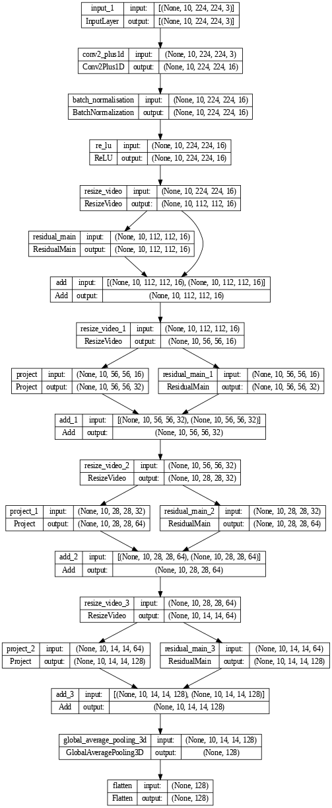

# Video Recommendation using (2+1)D Convolutional Networks

This project demonstrates a video recommendation system using a modified ResNet architecture with (2+1)D convolutions to generate video embeddings. Unlike traditional classification models, this approach focuses on creating a numerical representation (an embedding) for each video that captures its key features. These embeddings are then used to find and recommend similar videos, making it a powerful tool for building a content-based recommendation engine.

## Dataset

The project uses a subset of the [UCF101 dataset](https://www.crcv.ucf.edu/data/UCF101.php). The dataset contains various human actions across 101 categories. For this demonstration, the notebook uses a subset of 10 classes and downloads 50 video files per class. The dataset is then split into training, validation, and testing sets with a ratio of 30, 10, and 10 videos per class, respectively.

## Model Architecture

The core of this project is a custom deep learning model designed to generate high-quality video embeddings for similarity-based recommendation systems. Instead of simply classifying videos, this model produces a meaningful, fixed-size vector representation for each video.

The model is a sequential deep learning model built with the `tf.keras.Sequential` API, with its key components including:
* A custom `Conv2Plus1D` layer that decomposes a standard 3D convolution into a spatial convolution and a temporal convolution. This is computationally more efficient and effective for capturing spatial and temporal features.
* `ResidualMain` blocks with convolution, layer normalization, and ReLU activation functions to help with training deep networks.
* `Project` layers that align the dimensions of tensors in residual connections.
* A `ResizeVideo` layer that uses the `einops` library to resize the video tensor, allowing for a more flexible and robust model.

The crucial component for the recommendation task is the **embedding generation**. After the series of convolutional and residual blocks, a `GlobalAveragePooling3D` layer is used. The output of this layer is the **video embedding**—a fixed-size vector that encapsulates the content and action within the video.

Although the model was trained with a final `Dense` layer for a classification task on the UCF101 dataset to ensure it learned meaningful features, this final classification layer is removed for the recommendation task. The video embeddings from the `GlobalAveragePooling3D` layer can then be used to compute the similarity between any two videos (e.g., using cosine similarity) to find and recommend videos similar to a given input.

## Generating Recommendations

To generate video recommendations, we use the k-Nearest Neighbours (k-NN) algorithm. After generating embeddings for all videos in our dataset, we can find the most similar videos to a given query video by following these steps:

1. **Extract Embeddings**: The first step is to pass a new video through our trained model (with the final classification layer removed) to get its embedding vector.
2. **Vector Comparison**: The k-NN algorithm then compares this new embedding vector to all the other embedding vectors in our dataset. We use a similarity metric like cosine similarity to measure the "distance" or similarity between the vectors. A higher cosine similarity score indicates a closer relationship between the videos.
3. **Find the Nearest Neighbours**: We select the top k videos with the highest similarity scores to the query video. These are our "nearest Neighbours" in the embedding space.
4. **Recommend**: The titles or IDs of these k nearest Neighbours are then returned as the recommended videos.

This approach allows us to find videos that are semantically and visually similar to a given video, even if they don't share the same classification label.

## How to Run

1. **Clone the Repository:** Clone this GitHub repository to your local machine.
2. **Setup Environment:** Ensure you have Jupyter and the necessary Python libraries installed. The notebook includes a cell to install all required libraries, including `remotezip`, `tqdm`, `opencv-python`, `einops`, and `tensorflow`.
3. **Execute the Notebook:** Open and run the `main.ipynb` notebook in a Jupyter environment. The notebook will automatically download the required subset of the UCF101 dataset and proceed with training the model.
